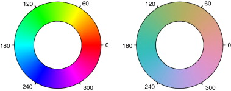
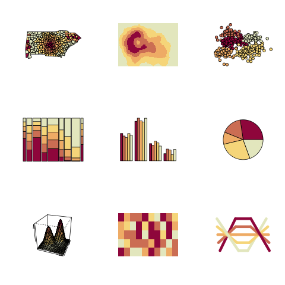

## packages

```{r pkgs,message=FALSE}
library(ggplot2)
library(dichromat)
## palettes etc.
library(viridis)
library(cividis)
library(colorspace)
library(RColorBrewer)
library(cowplot)
```

## use of colour

- qualitative (factors): want *distinctive* colours
    - probably can't get more than about 8 really distinctive colours
- qualitative (continuous values)
    - sequential or diverging
    - sequential scales should begin at the background colour

## fade via transparency gradient

```{r fade1}
dd <- data.frame(x=1:9)
ggplot(dd,aes(x=x,y=1,alpha=x))+
  geom_point(size=10,colour="red")+
  coord_fixed(ratio=5)
```


## fade via colour gradient

```{r fade2}
ggplot(dd,aes(x=x,y=1))+
  geom_point(size=10,aes(colour=x))+
  scale_colour_gradient(low="lightgray",high="red")+
  coord_fixed(ratio=5)
```

## saturation

* want large blocks of colour to be *unsaturated*/light
* small areas usually need to be saturated/darker

## `display.brewer.all()`

```{r brewer_all,fig.height=6,echo=FALSE}
display.brewer.all()
```

## colour spaces

- want *perceptually uniform* spaces [@zeileis_escaping_2009]
- RGB: additive, pixel-based
- HSV (hue, saturation, value): *unbalanced*
- HCL (hue, chroma, luminance): *balanced* [@zeileis_colorspace_2019]

## @zeileis_escaping_2009 Fig 1

Old Faithful data (duration vs waiting time)

{height=400px}

## @zeileis_escaping_2009 Fig 3

{width=100%}

## @zeileis_colorspace_2019 Fig 7

{width=100%}

## @zeileis_escaping_2009 Fig 4


## @zeileis_escaping_2009 Fig 7


## colorspace demos

```{r color_demo}
png("pix/colordemo.png")
par(mfrow = c(3, 3))
cl <- sequential_hcl(5, "Heat")
for (i in c("map", "heatmap", "scatter", "spine",
            "bar", "pie", "perspective", "mosaic", "lines")) {
  demoplot(cl, type = i)
}
dev.off()
```
##



## I Want Hue

Why stick to the outside of the colour space?

[demo](https://medialab.github.io/iwanthue/)

## colourblind-friendliness

* most common: [deuteranomaly](https://en.wikipedia.org/wiki/Color_blindness#Protanopia), $\approx$ 5% of males
* red-green axis is collapsed in various ways

## viridis vs. cividis

```{r viridis, echo=FALSE}
gg0 <- ggplot(dd,aes(x=x,y=1,colour=x)) +
  geom_point(size=10)+
  coord_fixed(ratio=5)+
  theme(legend.position="none")
plot_grid(gg0 +scale_colour_viridis(),
            gg0 + scale_colour_cividis(),
          align="h",
          ncol=1)
```

## illustrate dichromat package

## contrast illusions

Colour appearance depends on neighbours


([Wikipedia](https://en.wikipedia.org/wiki/Optical_illusion))

##

{width=75%}

## cultural expectations

## references
