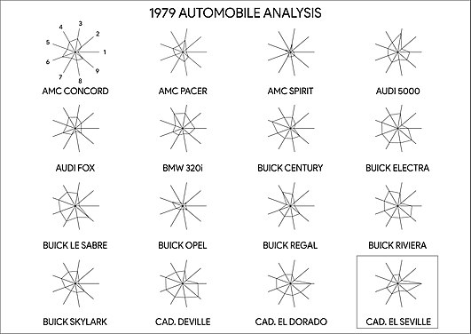

```{r pkgs, message=FALSE}
library(tourr)
library(factoextra)
library(pheatmap)
library(tidyverse)
```

## Data

We usually think of high-dimensional data as consisting of multiple _measures_ on a group of samples:

* Number of "reads" of different bacterial proteins from a set of soil samples
* Decathlon scores from different competitors
* Health measures from different children

## Types of measures

Many scientists traditionally think of high-dimensional data as having parallel, continuous measures:

* read matrices from soil samples

These may be complemented by a smaller number of “metadata” variables, which may be more diverse in type (count, categorical, etc.):

* environmental variables associated with soil samples

More and more datasets don't follow this:

* Canadian longitudinal study on aging has a huge number of variables per person with a wide mixture of types

## Duality

We study the rows (samples) using the columns (measures)

* What do the observed proteins tell us about the functional relationships between different soil samples?
* What does differential success in decathlon events tell us about the athletes?

But we can also do the opposite!

* What do measurements across soil samples tell us about the functional relationships between proteins?
* What does differential success of athletes tell us about the relationship between events?

- easiest: matrix of numeric values/Euclidean distances OK/MVN
- categorical
    - few values: can colour/split
	- many values: convert to dummy variables? (random forest viz?)
- non-Euclidean distances
    - e.g. species diversity

----------------------------------------------------------------------


## @buja_interactive_1996

- traces (functions: parallel coordinates, [Andrews plots](https://en.wikipedia.org/wiki/Andrews_plot))
- glyphs (stars/radar charts/faces/etc.)

## radar chart




## tours

three components:

- data matrix ($n \times p$)
- **tour path** that produces a smooth sequence of projection matrices ($p \times d$)
- **display method** that renders the projected data.

Goal: allow automated, systematic search through **entire** space of projections

---

```{r tour_laser,eval=FALSE}
animate_xy(laser)
```

## available display methods

```{r}
apropos("animate_")
```

## projections

Alternative: try to find some machinery 

```{r heatmap}
dec_mat <- as.matrix(scale(decathlon2[1:10]))
heatmap(dec_mat)
```

---

```{r corr_heatmap}
pheatmap(cor(dec_mat), cell.width = 10, cell.height = 10)
```

(see also the `corrplot` package)

## PCA

Examples/data from @holmes_modern_2019

- `prcomp` (SVD): preferred (also `princomp` ??)
- same data; projects in a way that (hopefully) focuses on interesting angles in the data
- assumes linear features
- normality not necessary, but better-behaved with normal data

---

View loadings:

```{r fviz_loadings}
pca_ath <- prcomp(dec_mat, scale=TRUE)
fviz_pca_var(pca_ath, col.circle = "black") + ggtitle("")
```

--- 

View scores and loadings:

```{r fviz_biplot}
fviz_pca_biplot(pca_ath)
```

## wine example

```{r wine1}
load("data/wine.RData")
load("data/wineClass.RData")

winePCAd = prcomp(wine,scale=TRUE) ## compute PCA
f0 <- fviz_pca_biplot(winePCAd, geom = "point", habillage = wine.class,
                      col.var = "violet", addEllipses = TRUE, ellipse.level = 0.69) +
  ggtitle("") + coord_fixed() +
  scale_colour_brewer(palette="Dark2") +
  scale_fill_brewer(palette="Dark2")
## make augmented data we can use
aug_data <- (get_pca_ind(winePCAd)$coord
  %>% as_tibble()
  %>% mutate(class=wine.class)
)
```

## plot

```{r plot_wine1}
print(f0)
```

## improved plot

```{r plot_wine2,message=FALSE}
f1 <- fviz_pca_biplot(winePCAd, geom = "point", habillage = wine.class,
   col.var = "violet") + ggtitle("") + coord_fixed() +
  scale_colour_brewer(palette="Dark2") +
  scale_fill_brewer(palette="Dark2")
names(ggplot_build(f1)$data[[1]])
f2 <- f1 + ggalt::geom_encircle(data=aug_data,
                          aes(x=Dim.1,y=Dim.2,group=class,
                              colour=class,
                              fill=class),alpha=0.2,
                          show.legend=FALSE)

```

--- 

```{r print_wineplot2}
print(f2)
```

## different projection methods

- Principal coordinates (PCoA: start from a *distance matrix*)
    - e.g. species diversity
	- text samples
    - PCoA + Euclidean distance = PCA
- non-metric multidimensional scaling (NMDS)
- non-negative matrix factorization 
- ... ???
- PCA [example](http://www.sthda.com/english/articles/31-principal-component-methods-in-r-practical-guide/118-principal-component-analysis-in-r-prcomp-vs-princomp/)

## challenges

- categorical/compositional data
- random forest viz?

## references
