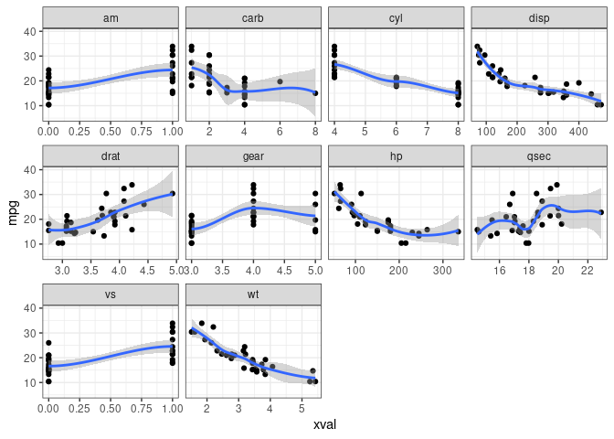
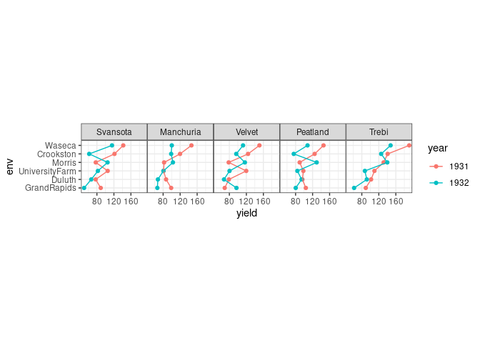
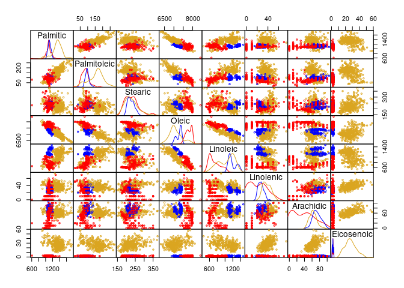
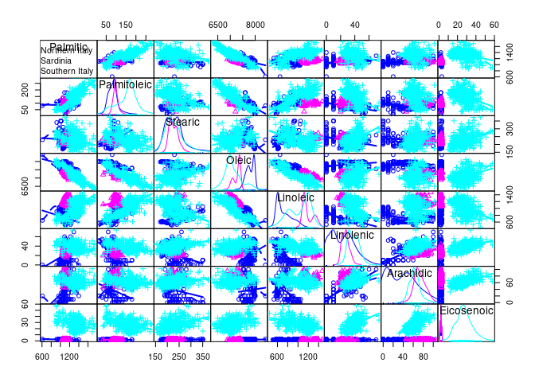
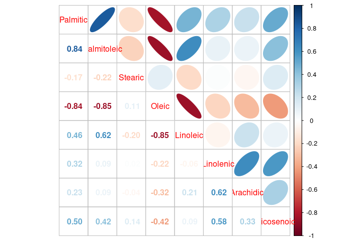

<!-- 
apa.csl is a slightly hacked version of APA 
  (modified for "et al" after 2 authors in text)
-->
<!-- .refs is style for reference page (small text) -->

<!--    content: url(https://i.creativecommons.org/l/by-sa/4.0/88x31.png)
>
<!-- Limit image width and height -->

    library(pgmm)    ## for olives data
    library(skimr)   ## for text-based summaries
    library(ggplot2); theme_set(theme_bw())
    library(GGally)   ## pairs plots etc.
    library(corrplot) ## correlation plots
    library(dplyr)    ## data manipulation
    library(tidyr)
    library(readr)    ## read CSV files
    library(agridat)  ## agricultural data sets

smooth curves; (g)lm vs loess vs GAM
------------------------------------

-   [loess](https://en.wikipedia.org/wiki/Local_regression)
    -   local polynomial regression (quadratic by default)
    -   used by default for N&lt;1000
    -   "Somewhat anecdotally, 'loess' gives a better appearance, but
        is O(N^2) in memory, so does not work for larger datasets"
    -   increase `span` to get smoother result
    -   could use `method.args = list(degree=1)` to get locally linear
        fit ...

GAM
---

-   additive model
-   penalized regression (decides on smoothness automatically)
-   typical results are smoother than loess
-   may oversmooth (try adjusting max knots, e.g.
    `formula = y ~ s(x,k=10,bs="cs")`)
-   can use e.g. `method.args = list(family=poisson)` to account for
    data ranges

(G)LMs
------

-   simplest, smoothest
-   but also most constraining
-   can fit polynomials, e.g. `formula= y ~ poly(x,2)`
-   use `method.arg=list(family=...)` as appropriate

multiple continuous predictors, single response
-----------------------------------------------

"melt" data to long format (`gather()`, `pivot_longer()`)

    cars_long <- pivot_longer(mtcars,
                              -mpg,  ## DON'T melt mpg
                              names_to="xvar",values_to="xval")
    g1 <- (ggplot(cars_long,aes(xval,mpg)) +
           geom_point()+
           facet_wrap(~xvar,scale="free_x")+
           geom_smooth()
    )

------------------------------------------------------------------------

    print(g1)  

    ## `geom_smooth()` using method = 'loess' and formula 'y ~ x'

multivariate data
-----------------

    data(olive,package="pgmm")
    data(fisher.barley,package="agridat")

Hints on looking for stuff
--------------------------

    library("sos")
    findFn("barley")      ## full-text search of CRAN
    ?RSiteSearch          ## similar
    help.search("barley",agrep=FALSE) ## search in *installed* package

Order data and factor-ize year
------------------------------

    ff <- (fisher.barley
      %>% mutate(gen=reorder(gen,yield),
                 env=reorder(env,yield),
                 year=factor(year))
      %>% arrange(gen,env)
    )

------------------------------------------------------------------------

    gg0 <- (ggplot(ff,
                   aes(x=env,y=yield,colour=year,group=year))
      ## geom_boxplot(aes(x=gen,y=yield,fill=factor(year)))
      + geom_point()+geom_line()
      + facet_wrap(~gen,nrow=1)  ## 1-row layout
    )

------------------------------------------------------------------------

    print(gg0)

------------------------------------------------------------------------

Hard to see x-axis labels: try rotating? `coord_flip()` doesn't interact
well with faceting (see also `ggstance`)

------------------------------------------------------------------------

    gg0_h <- (ggplot(ff,
                   aes(y=env,x=yield,colour=year,group=year))
            ## geom_boxplot(aes(x=gen,y=yield,fill=factor(year)))
      + geom_point()
      + geom_path()
      + facet_wrap(~gen,nrow=1)
      + theme(panel.spacing=grid::unit(0,"lines"))
      + coord_fixed(ratio=20)
    )

------------------------------------------------------------------------

    print(gg0_h)

First a pairs plot in base R:

    ## define a function for panel density
    panel.density <- function(x, ...)
    {
      usr <- par("usr"); on.exit(par(usr))
      par(usr = c(usr[1:2], 0, 1.5) ) ## modify y limits
      h <- lapply(split(x,olive2$region),density)
      for (i in 1:length(h)) {
        lines(h[[i]]$x,h[[i]]$y/max(h[[i]]$y),col=colvec[i])
      }
    }
    num_cols <- 3:ncol(olive2)

------------------------------------------------------------------------

    pairs(olive2[,num_cols],
          gap=0,     ## no spaces
          cex=0.5,   ## smaller points
          col=colvec[olive2$region],
          diag.panel=panel.density)

This took significant hacking to get the way I wanted it! haven't
adjusted the panels above the diagonal, yet ...

    ## https://stackoverflow.com/questions/37889222/change-colors-in-ggpairs-now-that-params-is-deprecated
    ggp1 <- ggpairs(olive2,
                    lower=list(continuous= function(data,mapping,...) {
                      (ggally_points(data,mapping,..., size=1)
                        + scale_colour_brewer(palette="Dark2")
                      )
                    }),
                    diag = list(continuous=function(data,mapping,...) {
                      (ggplot(data,mapping) 
                        + geom_density(...)
                        + scale_colour_brewer(palette="Dark2")
                      )
                    }),
                    upper = list(continuous=function(data,mapping, ...) {
                      (ggally_cor(data,mapping,...)
                        + scale_colour_brewer(palette="Dark2")
                      )
                    }),
                    columns=num_cols,
                    mapping=aes(colour=region))
    ## https://github.com/ggobi/ggally/issues/14
    theme_set(theme_bw()+ theme(panel.spacing=grid::unit(0,"lines")))

------------------------------------------------------------------------

    print(ggp1)

------------------------------------------------------------------------

    car::scatterplotMatrix(olive2[,num_cols],
                           groups=olive2$region,
                           gap=0)

------------------------------------------------------------------------

What about just showing correlations? (Probably not "exploratory".)

    library(corrplot)
    corrplot(cor(olive2[,num_cols]),method="ellipse")

------------------------------------------------------------------------

    corrplot.mixed(cor(olive2[,num_cols]),lower="number",upper="ellipse")

