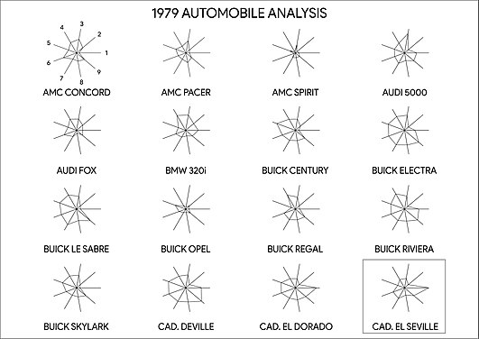

## packages

Some may be harder to install than others.

```{r pkgs, message=FALSE}
library(tourr)
library(rggobi)
## remotes::install(...)
library(factoextra)
library(pheatmap)
library(tidyverse)
```

## definition

- "dimension" = "number of variables"
- **may** be divided into predictors and (1+) responses
- typically looking for *low-dimensional* structure
      - clusters
	  - surfaces/manifolds
- exploratory? diagnostic? expository?
- often requires more machinery

## types

- easiest: matrix of numeric values/Euclidean distances OK/MVN
- categorical
     - few values: can colour/split
	 - many values: convert to dummy variables? (random forest viz?)
- non-Euclidean distances
     - e.g. species diversity
	 
## @buja_interactive_1996

- scatterplots (point locations)
- traces (functions: parallel coordinates, [Andrews plots](https://en.wikipedia.org/wiki/Andrews_plot))
- glyphs (stars/radar charts/faces/etc.)

## radar chart



## tasks

* finding gestalt: focusing views (projection)
* posing queries: brushing/linking
* making comparisons: arranging many views

## focusing: animation/motion

* adds a dimension (2D to 3D)
* smoothness/object continuity
* real-time user control: allows user to search/tune

## interactive example

```{r eval=FALSE}
ggobi(laser)
```

## tours

three components:

- data matrix ($n \times p$)
- **tour path** that produces a smooth sequence of projection matrices ($p \times d$)
- **display method** that renders the projected data.

Goal: allow automated, systematic search through **entire** space of projections

---

```{r eval=FALSE}
animate_xy(laser)
```

## options

```{r}
apropos("animate_")
```

## projections

Alternative: try to find some machinery 

```{r}
## athletes = data.frame(olympic$tab)
dec_mat <- as.matrix(scale(decathlon2[1:10]))
heatmap(dec_mat)
```

---

```{r}
pheatmap(cor(dec_mat), cell.width = 10, cell.height = 10)
```

## PCA

Examples/data from @holmes_modern_2019

- `prcomp` (SVD): preferred (also `princomp` ??)
- same data; projects in a way that (hopefully) focuses on interesting angles in the data
- assumes linear features
- normality not necessary, but better-behaved with normal data

---

View loadings:

```{r}
pca_ath <- prcomp(dec_mat, scale=TRUE)
fviz_pca_var(pca_ath, col.circle = "black") + ggtitle("")
```

--- 

View scores and loadings:

```{r}
fviz_pca_biplot(pca_ath)
```

## wine example

```{r}
load("data/wine.RData")
load("data/wineClass.RData")

winePCAd = prcomp(wine,scale=TRUE)
fviz_pca_biplot(winePCAd, geom = "point", habillage = wine.class,
   col.var = "violet", addEllipses = TRUE, ellipse.level = 0.69) +
  ggtitle("") + coord_fixed() +
  scale_colour_brewer(palette="Dark2") +
  scale_fill_brewer(palette="Dark2")
aug_data <- (get_pca_ind(winePCAd)$coord
  %>% as_tibble()
  %>% mutate(class=wine.class)
)
```

## improve

f0 <- fviz_pca_biplot(winePCAd, geom = "point", habillage = wine.class,
   col.var = "violet") + ggtitle("") + coord_fixed() +
  scale_colour_brewer(palette="Dark2") +
  scale_fill_brewer(palette="Dark2")
names(ggplot_build(f0)$data[[1]])
f0 + ggalt::geom_encircle(data=aug_data,
                          aes(x=Dim.1,y=Dim.2,group=class,
                              colour=class,
                              fill=class),alpha=0.2,
                          show.legend=FALSE)

```

## different projection methods

- Principal coordinates (PCoA: start from a *distance matrix*)
    - e.g. species diversity
	- text samples
    - PCoA + Euclidean distance = PCA
- non-metric multidimensional scaling (NMDS)
- non-negative matrix factorization 
- ... ???

## [example](http://www.sthda.com/english/articles/31-principal-component-methods-in-r-practical-guide/118-principal-component-analysis-in-r-prcomp-vs-princomp/)

## challenges

- categorical/compositional data
- random forest viz?

## references
