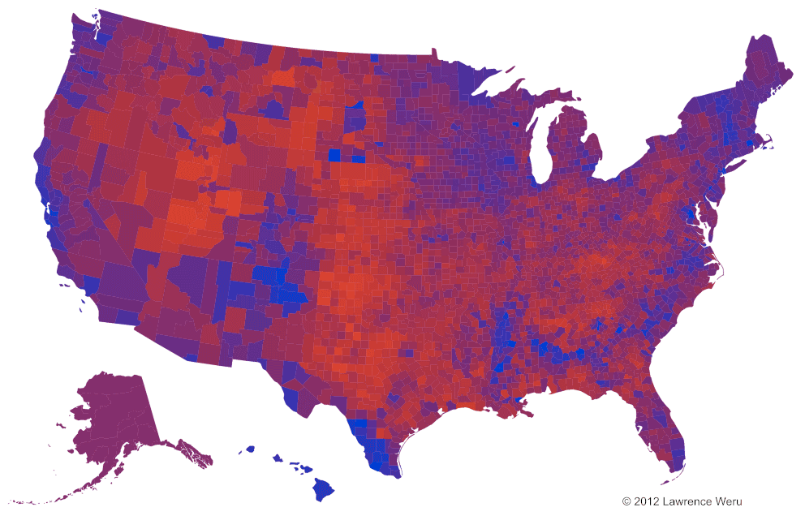

# spatial data

## types of spatial data

* "space" is generally 2D ($\mathbb{R}^2$; could be surface of a sphere)
* also: networks, trees, lattices, ...
* **features**: points, polygons, lines (and collections thereof); **rasters**
* also: continuous or categorical values *associated* with features
     * counts (disease incidence) or continuous values (GDP) associated with polygons (countries/provinces/counties)
	 * values associated with grid cells (digital elevation models)
	 * points (locations of murders)
	 
## transformations/summarization

e.g. 

* points to density fields (2D kernel density estimation)
* points to polygon values (square or hex binning)
* fields to polygons (contouring)
* point values to fields (interpolation; `akima` does bicubic/bilinear)

## typical plots

* points on maps
* contour plots on maps
* **choropleth** maps (filled polygons)

[spatial graph gallery](https://edzer.github.io/sp/)

## spatial data challenges

* big (especially rasters)
* sphere to 2D:
     - projections  [xkcd maps](https://xkcd.com/977/)
	 - CRS or *datums* [@bivand_applied_2013]
* shapefile formats
  * geocoding (name to coordinates); reverse geocoding (coordinates to name)
* see [R Spatial task view](https://cran.r-project.org/web/views/Spatial.html)
* [intro to visualizing spatial data in R](https://cran.r-project.org/doc/contrib/intro-spatial-rl.pdf)

## spatial data and colour

* colour issues are much more salient for spatial data
* big blocks of colour
* often use colour gradients for continuous data
* continuous vs segmented, appropriate endpoints (background)
* [ColorBrewer project](http://colorbrewer2.org), `RColorBrewer` package

## primary packages for spatial data manipulation

* `sf` ("simple features"): tidy spatial data ([web page](https://r-spatial.github.io/sf/))
* `maptools`

## spatial plotting challenges

* top of Cleveland hierarchy (x,y coordinates) are used up
* insets (Alaska/Hawaii etc.)
* map decoration
* representing uncertainties: @correll_value-suppressing_2018, @maceachren_visualizing_2005, @koo_geovisualizing_2018
* not misrepresenting areas (e.g. cartograms: @perrier_topogram_2019, @hohle_cartograms_2016)
     * [red/blue maps](https://www.core77.com/posts/90771/A-Great-Example-of-Better-Data-Visualization-This-Voting-Map-GIF)
     * [red/blue/purple maps](https://medium.com/matter/the-trouble-with-the-purple-election-map-31e6cb9f1827)
* linking?
	 
---

---

	 
## primary R packages

* `maps` (base-R maps, some basic spatial data sets)
* `ggmap` (maps in ggplot, including downloading data from google maps etc.)
* `leaflet` (map widget)
* `tmap` (an alternative ggplot-like approach: see [here](https://geocompr.robinlovelace.net/adv-map.html))

## to do

- [Canada ridings animation](https://fishandwhistle.net/post/2019/canada-ridings-hex/); data etc. [here](https://github.com/paleolimbot/blogdown-site/tree/master/content/post/2019-10-21-ridings)
- `mapcan` package?
