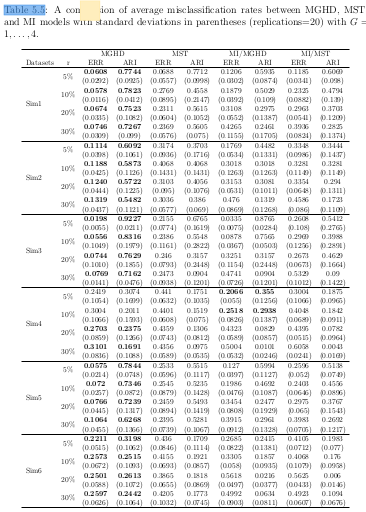

# setup

## load packages

```{r pkgs,message=FALSE}
## graphics
library(ggplot2)
theme_set(theme_bw()+theme(panel.spacing=grid::unit(0,"lines")))
library(directlabels)
## modeling/coef plots
library(lme4)
library(broom)
library(dotwhisker)
library(ggstance) ## horizontal geoms
library(stargazer)
## manipulation
library(tidyr)
library(dplyr)
library(purrr)
library(readr)
```

# turning tables into graphs

## why graphs instead of tables?

- @gelman_lets_2002; @gelman_why_2011

> tables are best suited for looking up specific information, and graphs are better for perceiving trends and making comparisons
and predictions

- easier to read and compare
- easier to perceive magnitudes
- less prone to dichotomization

## why not tables instead of graphs?

- looking up specific values (dynamic graphs?)
- cultural familiarity
- includes all the information
     - include data separately/machine-readably?
	 
## principles

- use small multiples
- use appropriate scales
- Cleveland hierarchy etc.

## example: @wei_extending_2017 Table 5.5



## rearranged data

```{r get_data,message=FALSE}
## need read_table2() for 'irregular' data
dd <- read_table2("data/wei_tab5.5.txt")
head(dd)
```
    
## rearrange

```{r rearrange}
dd2 <- (dd
    %>% gather(key=model,value=val,-c(dataset,r,type))
    %>% separate(model,into=c("model","stat"),sep="\\.")
    %>% spread(key=type,value=val) ## est + sd in a single row
)
head(dd2)
```

```{r simtab}
simtab <- read.table(header=TRUE,text="
dataset distribution covstruc separation
sim1 MGHD VEE well-separated
sim2 MGHD VEE overlapping
sim3 MST VEI well-separated
sim4 MST VEI overlapping
sim5 GMM VEE well-separated
sim6 GMM VEE overlapping
")
dd3 <- dd2 %>% merge(simtab,by="dataset")
```

## code

```{r code}
gg1 <- (ggplot(dd3,aes(factor(r),est,colour=model)) 
  + geom_point()+geom_line(aes(group=model))   ## points and lines
  ## transparent ribbons, +/- 1 SD:
  + geom_ribbon(aes(ymin=est-sd,ymax=est+sd,group=model,fill=model),
                colour=NA,alpha=0.3)
  ## limit y-axis, compress out-of-bounds values
  + scale_y_continuous(limits=c(0,1),oob=scales::squish)
  + facet_grid(stat~distribution+covstruc+separation)
  + labs(x="r (proportion missing)",y="")
  + scale_colour_brewer(palette="Dark2")
  + scale_fill_brewer(palette="Dark2"))
```

## picture

```{r plot,echo=FALSE,cache=TRUE}
print(gg1)
```

## possible improvements?

- order models
- colour panel backgrounds according to whether well-separated or not (`geom_rect`)
- direct labeling (only in rightmost facets?)
- could collapse sim labels
- change x-axis to continuous?
- invert ARI or ERR so rankings are the same?

## references {.smaller}
